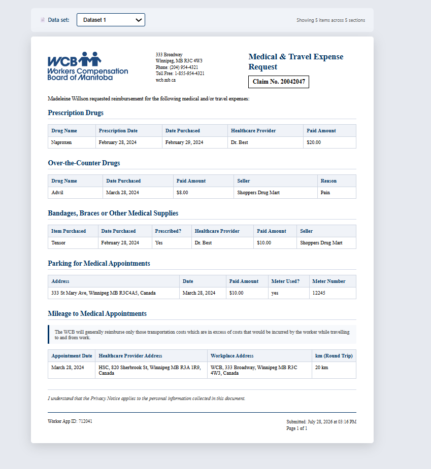
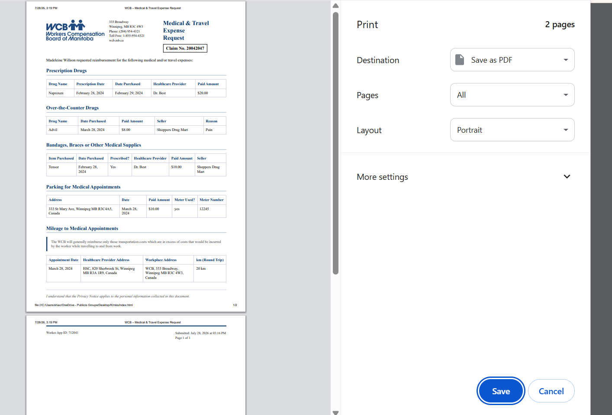

# KEERTHANA M S - Medical & Travel Expense Request Form

## Description

This project recreates the Medical & Travel Expense Request form using HTML, CSS, JavaScript and Pug templates.

The form displays claim information and expense details using sample data. Different datasets can be selected from the dropdown to demonstrate how the content updates dynamically.

## Project Files

- index.html
- styles.css
- script.js
- templates/mixins.pug
- templates/medical-expense.pug
- templates/worker-progress.pug

## Features

- Dataset switching
- Dynamic content rendering
- Reusable functions
- Pug templates and mixins
- PDF print support

## How to Run

1. Open index.html in a browser.
2. Select a dataset from the dropdown.
3. Use Ctrl + P to view the printable PDF version.

## Demo Video

Video Link:

https://drive.google.com/file/d/1mahh5iXh2PHsXw-RbpjlD3c17jjWG7fg/view?usp=drive_link

## Sample Screenshots

### Application View

### PDF Print Preview

## Author

KEERTHANA M S
